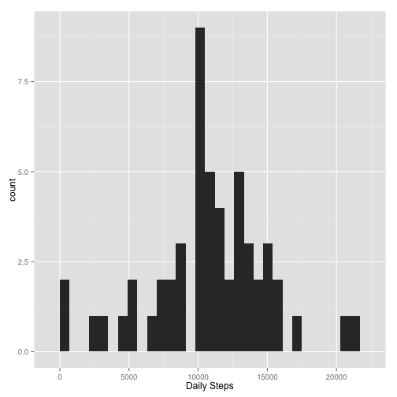
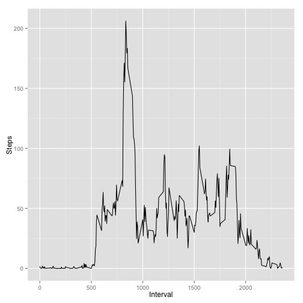
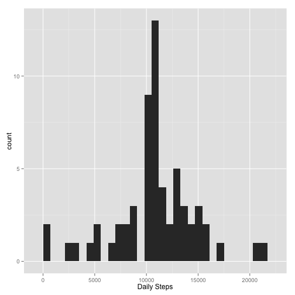
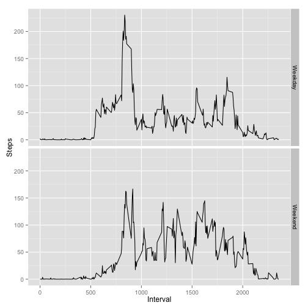

### Peer Assignment 1

The database recording a single individual's steps from October to November 2012, in 5 minute intervals, was downloaded from https://d396qusza40orc.cloudfront.net/repdata%2Fdata%2Factivity.zip on 4/9/2015 at 1:40 pm EST. The following analysis was performed:

The data was loaded from the working directory and necessary packages were called.


```r
data <- read.csv("activity.csv")
library(ggplot2)
library(dplyr, warn.conflicts = FALSE)
```

The total number of steps taken per day was determined and plotted on a histogram.


```r
dailySteps <- tapply(data$steps, data$date, sum) 
qplot(dailySteps, xlab = "Daily Steps", binwidth = 700)
```

 

Then the mean and median number of steps taken per day, excluding NA values, was calculated.


```r
mean(dailySteps, na.rm=T)
```

```
## [1] 10766.19
```

```r
median(dailySteps, na.rm=T)
```

```
## [1] 10765
```

The average daily activity pattern was determined by calculating the average steps per 5-minute interval in the day over all days recorded. This was then plotted.


```r
interval_activity <- tapply(data$steps, data$interval, mean, na.rm=T)
df <- data.frame(Interval = unique(data$interval), Steps = interval_activity)
qplot(Interval, Steps, data = df, geom="line")
```

 

The 5-minute interval with the maximum average number of steps was found using the code below. 


```r
m <- max(df$Steps)
df[df$Steps == m,]
```

```
##     Interval    Steps
## 835      835 206.1698
```

The study subject took the most steps per 5-minute inteval from 8:30 - 8:35 am.

There were the following number of time intervals missing step count values in the dataset:


```r
sum(is.na(data$steps))
```

```
## [1] 2304
```

To remove missing values,imputation by substituting missing values with their associated interval means was utilized.


```r
data$interval_num <- rep.int(1:288,61)
imputeSteps <- function() {
      for (i in 1:nrow(data)) {
              if (is.na(data$steps[i])) {
                      int_num <- data$interval_num[i]
                      val <- df[int_num,2]
                      data$steps[i] <- val
              } else {next}
      }
      data
}
data_imp <- imputeSteps()
```

The daily step count was then recalculated and plotted on a histogram.


```r
dailyStepsImp <- tapply(data_imp$steps, data_imp$date, sum)
qplot(dailyStepsImp, xlab = "Daily Steps", binwidth = 700)
```

 

The mean and median number of steps taken per day, with imputed values, was calculated.


```r
mean(dailyStepsImp)
```

```
## [1] 10766.19
```

```r
median(dailyStepsImp)
```

```
## [1] 10766.19
```

The difference between the original and imputed mean and median steps was found below. 


```r
(mean(dailySteps, na.rm=T))-(mean(dailyStepsImp))
```

```
## [1] 0
```

```r
(median(dailySteps, na.rm=T))-(median(dailyStepsImp))
```

```
## [1] -1.188679
```

With this imputation strategy using means to replace missing values, there was no difference in mean daily steps. However, there was a small difference in median daily steps.

To determine if there was a difference between weekday and weekend activity, the following code was used to classify each day on the imputed dataset.


```r
data_imp$date <- as.Date(data_imp$date)
weekend <- function () {
        for (i in 1:nrow(data_imp)) {
                if (weekdays(data_imp$date[i]) == "Saturday" | weekdays(data_imp$date[i]) == "Sunday") {
                        data_imp$DOW[i] <- "Weekend"
                } else {
                        data_imp$DOW[i] <- "Weekday"
                }
        }
        data_imp$DOW <- as.factor(data_imp$DOW)
        data_imp
}
data_imp2 <- weekend()
```

The differences in activity patterns between weekdays and weekends was then plotted using the code below.


```r
grp_data <- group_by(data_imp2, interval, DOW)
df2 <- summarize(grp_data, Steps = mean(steps))
qplot(interval, Steps, data = df2, geom="line", xlab = "Interval", facets = DOW~.)
```

 
